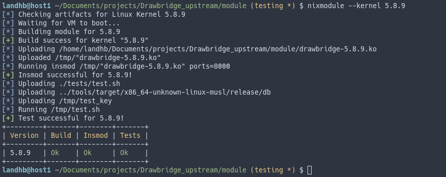

# NixModule [![cargo-badge][]][cargo-link]

Simple qemu wrapper to automatically test out-of-tree linux kernel modules across multiple kernel versions. The provided images all have `KASAN` to aide your development.

```sh
cargo install nixmodule
```

- [Pre-Built Kernels](#pre-built-kernels)  
- [Pre-Built Disk Images](#pre-built-disks)  
- [Using Other Kernels](#using-other-kernels)  
- [Using Other Disk Images](#using-other-disks)  


Example below running it against a single kernel, running without arguments tests against every kernel in your [`nixmodule-config.toml`](example/nixmodule-config.toml):

<p align="center">
  
</p>

## Pre-Built Kernels <a name="pre-built-kernels"/>

Check [`nixmodule-config.toml`](example/nixmodule-config.toml) for an example configuration using all of these images.

| Version | BzImage   | Headers | LTS? |
| :---:   | :---:     | :---:   | :---:   | 
| 5.17.2  | [bZimage](https://files.sboc.dev/linux-kernels/bzImage-linux-5.17.2) | [Headers](https://files.sboc.dev/linux-headers/linux-5.17.2-headers.tar.gz)|    | 
| 5.15.33   | [bZimage](https://files.sboc.dev/linux-kernels/bzImage-linux-5.15.33)  | [Headers](https://files.sboc.dev/linux-headers/linux-5.15.33-headers.tar.gz)|  Yes  | 
| 5.10.110   | [bZimage](https://files.sboc.dev/linux-kernels/bzImage-linux-5.10.110)  | [Headers](https://files.sboc.dev/linux-headers/linux-5.10.110-headers.tar.gz)|  Yes  | 
| 5.8.9   | [bZimage](https://files.sboc.dev/linux-kernels/bzImage-linux-5.8.9)  | [Headers](https://files.sboc.dev/linux-headers/linux-5.8.9-headers.tar.gz)|    | 
| 5.4.188 | [bZimage](https://files.sboc.dev/linux-kernels/bzImage-linux-5.4.188)| [Headers](https://files.sboc.dev/linux-headers/linux-5.4.188-headers.tar.gz)| Yes  | 
| 4.19.237| [bZimage](https://files.sboc.dev/linux-kernels/bzImage-linux-4.19.237) | [Headers](https://files.sboc.dev/linux-headers/linux-4.19.237-headers.tar.gz)| Yes  | 
| 4.14.275| [bZimage](https://files.sboc.dev/linux-kernels/bzImage-linux-4.14.275) | [Headers](https://files.sboc.dev/linux-headers/linux-4.14.275-headers.tar.gz)| Yes | 
| 4.9.309| [bZimage](https://files.sboc.dev/linux-kernels/bzImage-linux-4.9.309) | [Headers](https://files.sboc.dev/linux-headers/linux-4.4.309-headers.tar.gz)| Yes  | 
| 4.4.302| [bZimage](https://files.sboc.dev/linux-kernels/bzImage-linux-4.4.302) | [Headers](https://files.sboc.dev/linux-headers/linux-4.4.302-headers.tar.gz)| Yes | 

## Pre-Built Disk Images <a name="pre-built-disks"/>

| Name    | Link      | SSH Key |
| :---:   | :---:     | :---:   |
| Syzkaller Debian Buster   | [Image](https://files.sboc.dev/images/syzkaller-buster/buster.img)  | [Key](https://files.sboc.dev/images/syzkaller-buster/buster.id_rsa)  |
| Syzkaller Debian Stretch   | [Image](https://files.sboc.dev/images/syzkaller-stretch/stretch.img)  | [Key](https://files.sboc.dev/images/syzkaller-stretch/stretch.id_rsa)  |

## Using Other Kernels <a name="using-other-kernels"/>

Use the packing script

```sh
KERNEL=4.14.275 ./scripts/package.sh
```

This builds the required `bzImage` and an archive `linux-$VERSION-headers.tar.gz` containing the headers/module info required to build an out-of-tree kernel module.

Then add the new kernel to your configuration file `nixmodule-config.toml`:

```toml
[[kernels]]
version = "4.19.237"
url_base = "https://files.sboc.dev"
headers = "linux-headers/linux-4.19.237-headers.tar.gz" 
kernel = "linux-kernels/bzImage-linux-4.19.237"
runner = "qemu-system-x86_64"

[kernels.disk]
name = "stretch"
url_base = "https://files.sboc.dev"
path = "images/stretch/stretch.img"
sshkey = "images/stretch/stretch.id_rsa"
boot = "/dev/sda"
```

You can optionally disable kvm with:

```toml
kvm = false
```

And increase the boot timeout with:

```toml
timeout = 600
```

Without kvm you'll likely need to increase the default the timeout.

## Using Other Disk Images <a name="using-other-disks"/>

Fill out the `[kernels.disk]` entry for the kernel you'd like to use the new disk with:

```toml
[kernels.disk]
name = "stretch"
url_base = "https://files.sboc.dev"
path = "images/stretch/stretch.img"
sshkey = "images/stretch/stretch.id_rsa"
boot = "/dev/sda"
```

Boot should contain the partition to boot from. This is passed to qemu to append as kernel arguments:

```
-append "console=ttyS0 root=$BOOT earlyprintk=serial net.ifnames=0 nokaslr"
```

[//]: # (badges/links)
[cargo-badge]: https://img.shields.io/crates/v/nixmodule.svg?label=crates.io
[cargo-link]: https://crates.io/crates/nixmodule
